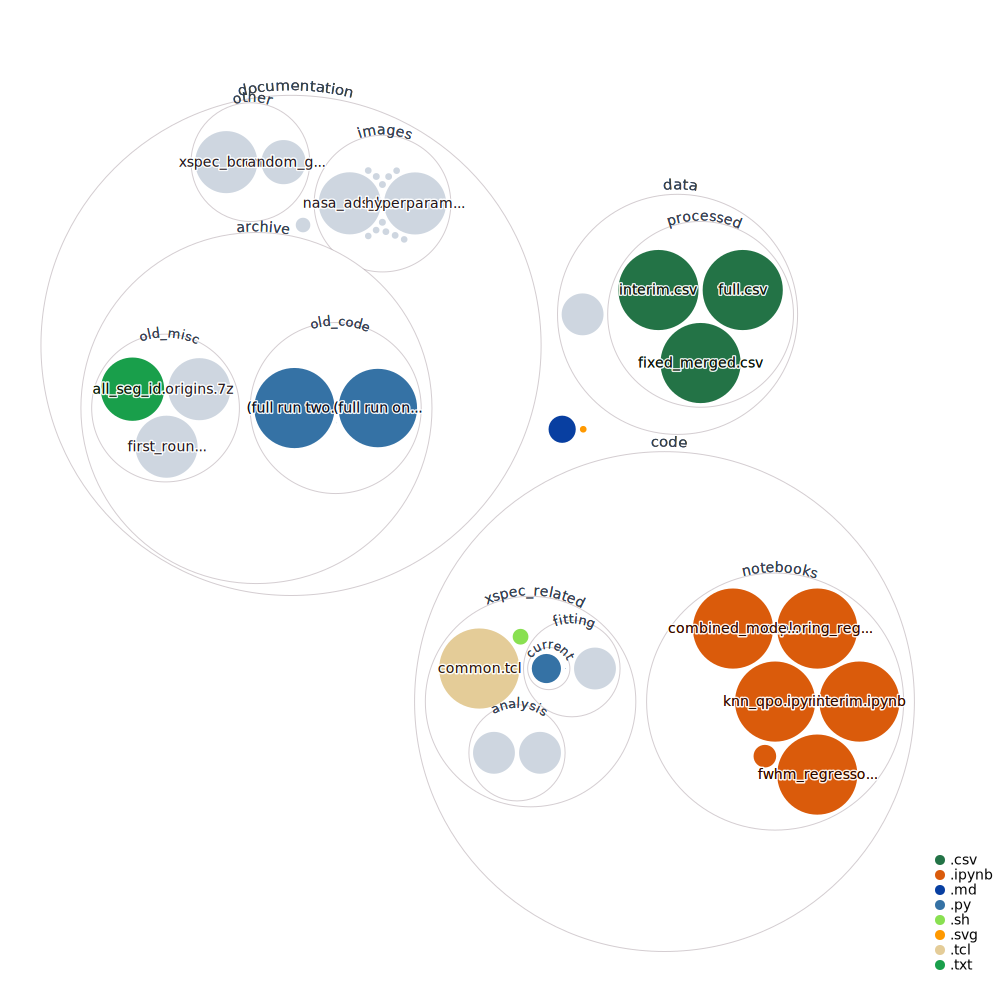

# MAXI-J1535
## About this project

### Miscellaneous Notes
* Keep a google colab session from disconnecting by either adding this snippet of code in the google console (via inspect element): 

<pre><code> javascript 
function ConnectButton(){
  console.log("Connect pushed"); 
  document.querySelector("#top-toolbar > colab-connectbutton").shadowRoot.querySelector("#connect").click() 
}
setInterval(ConnectButton,60000);
</code></pre> 

or by adding this snippet of code ```python while True:pass``` in a cell after the cell you are currently running and running it in queue. 

## About this repo


