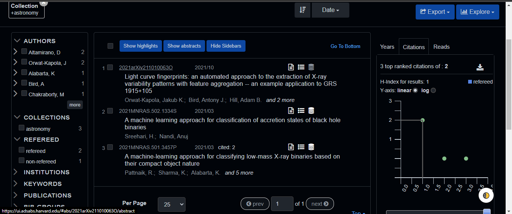

# Misc. Thoughts
* It seems that we would be innovating with this work as a quick search on ADS reveals no similiar works have been published(?):  

* This plot seems interesting, relevant, and informative:  

* Is the plot in this paper an appropriate way to show maximum accuracy: https://arxiv.org/pdf/1903.07167.pdf
* This is the one with the grid search plot: https://arxiv.org/pdf/2109.10503.pdf